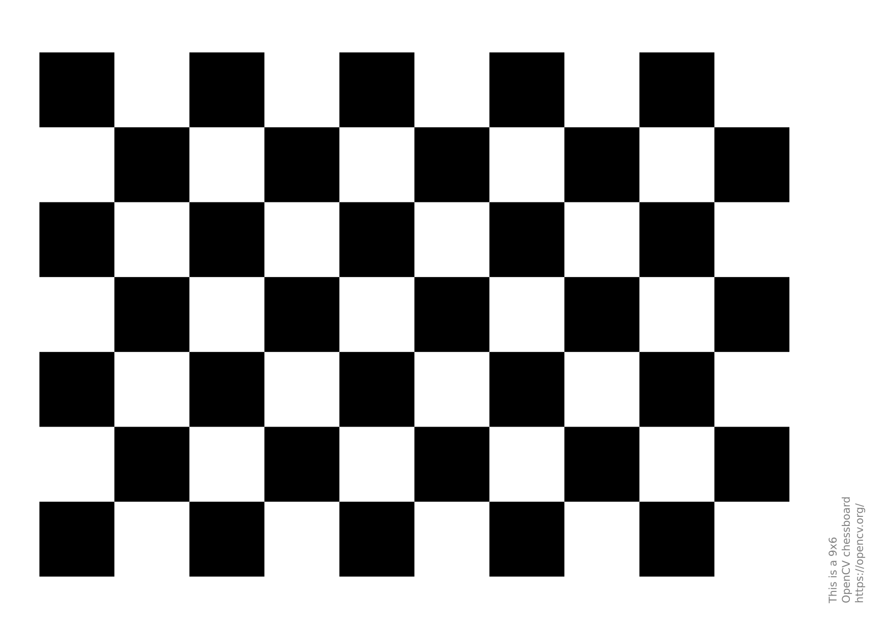

# Camera calibration
Camera calibration is the process of estimating the parameters of a pinhole camera model approximating the camera that produced a given photograph or video. The extrinsic parameters define the camera pose (position and orientation) while the intrinsic parameters specify the camera image format (focal length, pixel size, and image origin). In our project we use an **Intel Realsense D455** RGDB camera. In this branch we provide two Python files `imageAcquisition.py`, `calibration.py` which can be used respectively to acquire a set of pictures with the Intel Realsense D455 and to perform the OpenCV calibration procedure. For the sake of the calibration process we have used the popular checkboard pattern (`pattern.png`). In `d455_openCV.yaml` we provide the outcome of the calibration process together with the other parameters which are required by ORBSLAM algorithm.

```
Camera matrix : 
[[648.58558481   0.         634.23923642]
 [  0.         646.68775744 380.01879757]
 [  0.           0.           1.        ]]
dist : 
[[-0.07075501  0.16013139 -0.0017203   0.00034952 -0.16619563]]
rvecs : 
( array([[0.37606437],
       [0.29994734],
       [0.13503186]]),
  array([[ 0.32087422],
       [-0.16655451],
       [ 0.09784946]]),
  array([[ 0.41778809],
       [-0.22118523],
       [ 0.01066545]]),
  array([[ 0.57829364],
       [-0.069551  ],
       [ 1.37689311]]),
  array([[-0.17283084],
       [-0.19952102],
       [ 3.06841616]]),
  array([[ 0.11363738],
       [-0.47124468],
       [ 1.32381506]]),
  array([[0.4023277 ],
       [0.45518634],
       [0.09056216]]),
  array([[ 0.48797845],
       [-0.60996363],
       [ 1.24275998]]),
  array([[ 0.30283037],
       [-0.2308078 ],
       [ 0.11583634]]),
  array([[ 0.31711201],
       [-0.34889877],
       [ 0.13989302]]))
tvecs : 
( array([[-7.06645874],
       [-8.54475625],
       [26.17782263]]),
  array([[-8.36047471],
       [-6.21327392],
       [22.55990339]]),
  array([[-4.0303387 ],
       [-5.30976121],
       [17.84340653]]),
  array([[ 4.5093358 ],
       [-5.60778563],
       [13.60562986]]),
  array([[ 6.09785618],
       [ 6.23015654],
       [21.8060786 ]]),
  array([[ 5.35852866],
       [-6.00190344],
       [24.05102631]]),
  array([[-3.77086716],
       [-6.29881468],
       [27.46436187]]),
  array([[ 4.21840967],
       [-7.49809629],
       [20.42704489]]),
  array([[-2.41996321],
       [-3.50305003],
       [19.40977126]]),
  array([[-1.9585297 ],
       [-3.74149976],
       [18.39507054]]))

Re-projection error : 
total error: 0.014423662702777876
```
### imageAcquisition.py
In order to execute the Python script simply type:
```
python3 imageAcquisition.py
```
Press 'c' on your keyboard to save the current frame.
Press 'q' on your keyboard to stop the process.
### calibration.py
The script executes the OpenCV calibration procedure. Please, save and execute this code from the same folder where you have stored the pictures of the calibration pattern.
```bash
python3 calibration.py [-x, --rows] (number of inside corners in the X direction. Default value is 9.) [-y, --columns] (number of inside corners in the Y direction. Default value is 6.)
```
