# E-Agle Trento Racing Team Perception System
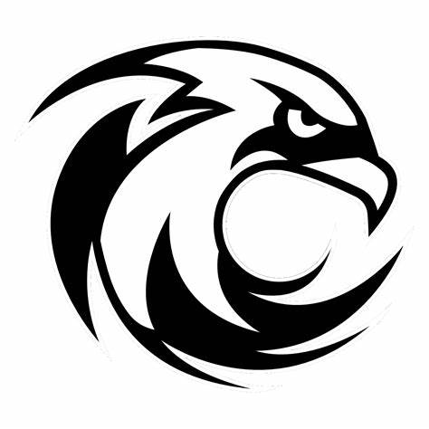
## Simultaneous Localization and Mapping for Formula Student Driverless Race Car
Within this GitHub repository lies the code for the perception system of the E-Agle Trento racing team's autonomous vehicle. As of November 17th, 2023, the current implementation aims to establish a minimum viable software, serving as a foundational framework that will undergo continuous refinement and enhancement throughout the years.
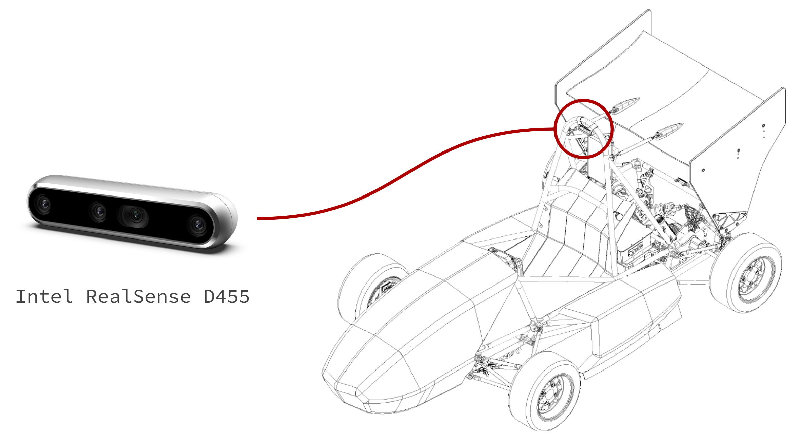
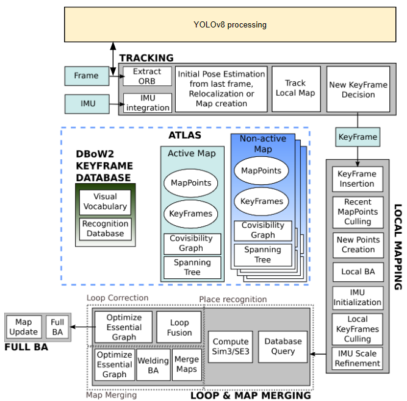
### Task
Our primary objective revolves around deploying a robust software solution designed to address the **Simultaneous Localization and Mapping problem (SLAM)** within the Formula Driverless competition framework. This solution centers on leveraging an RGBD camera sensor, specifically the Intel RealSense D455, to gather environmental data. Thus, the repository in question presents an implementation of Visual SLAM tailored to effectively tackle this challenge.
### Branches
#### camera calibration
This branch hosts Python code developed with OpenCV for camera calibration purposes. Within this branch, two scripts are available: one dedicated to capturing images of the calibration target, while the second script processes these acquired frames to derive essential camera intrinsic and extrinsic parameters.
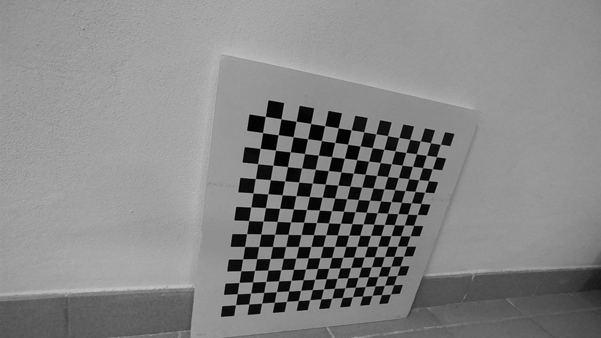
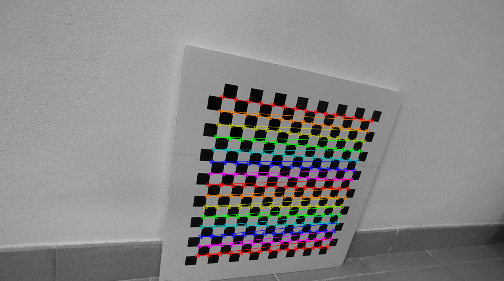
#### orbslam2
Initially, our focus for implementation centered on the ORBSLAM2 algorithm as our starting point. This deliberate choice allowed us to thoroughly examine the ORBSLAM2 codebase, serving as a foundational step in comprehending its structure. We found this approach advantageous given that the source files of ORBSLAM3 are notably more intricate and challenging to grasp. After becoming familiar with ORBSLAM2, delving into the third version of the algorithm became more manageable.
Within this branch, you'll find instructions to execute ORBSLAM2 on a video sequence recorded by our Intel RealSense D455 camera. The code is adaptable for real-time usage with a USB-connected camera. Upon completion of the execution, we store the map generated by the algorithm along with the camera's trajectory in a human-readable format. Additionally, throughout the execution, real-time coordinates of the camera in the actual environment are accessible, enhancing the localization capability.
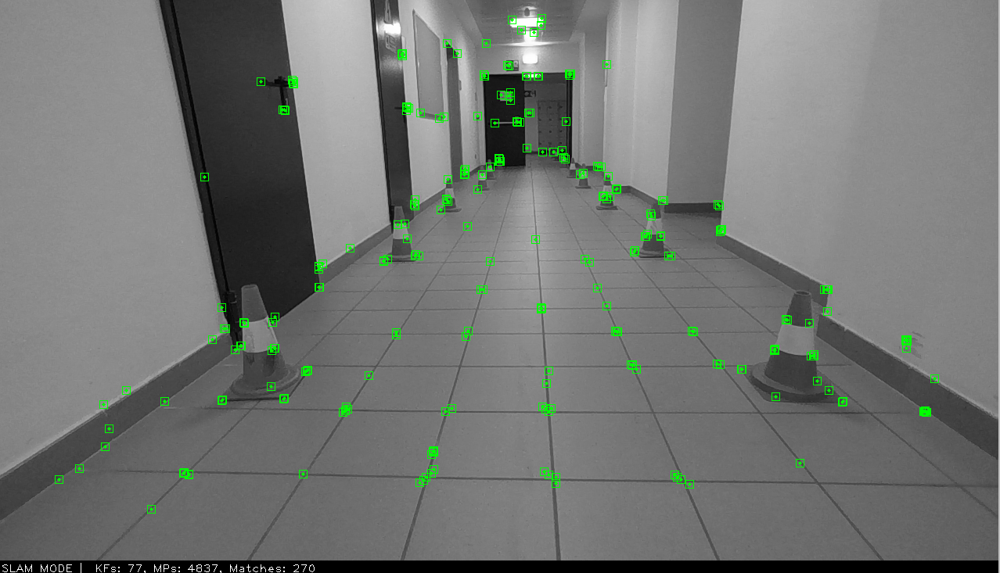
#### orbslam3-yolo
Building upon our exploration of ORBSLAM3, we've expanded our approach by integrating YOLOv8 into the visual SLAM algorithm pipeline. This integration extends our solution by incorporating cone detection and classification, crucial for circuit delineation. Utilizing the Formula SAE's official dataset, we trained YOLOv8 to accurately identify and classify cones that mark the circuit boundaries. The process involves YOLOv8 detecting cones within the video frame and enclosing them within bounding boxes. Subsequently, we filter the ORB features specific to these cones. Extracting the corresponding 3D coordinates from these features provides us with their real-world positioning (x, y, z). Leveraging this data, we construct a live representation of the circuit, continually updated in real-time, using the located cone coordinates.
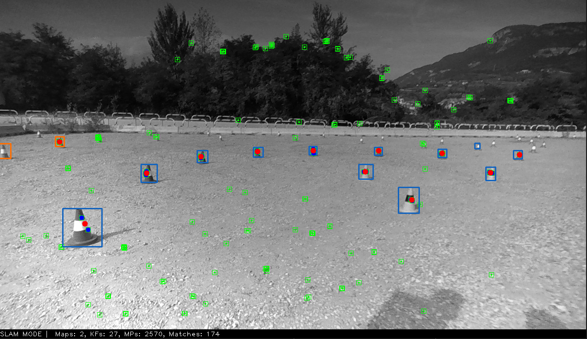
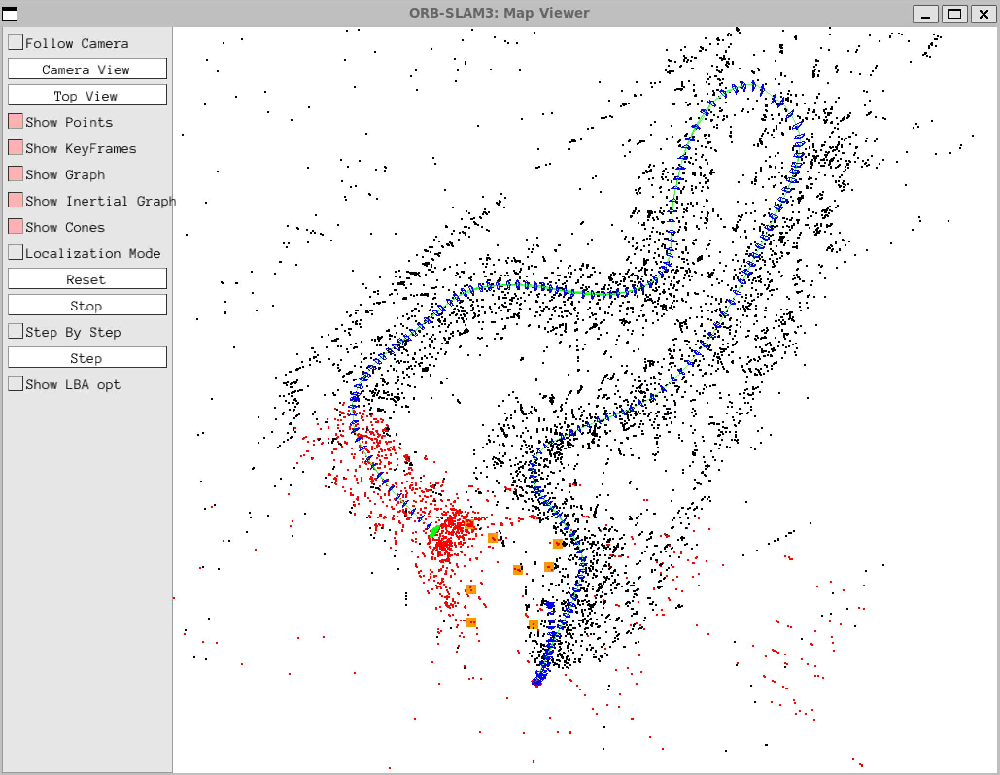
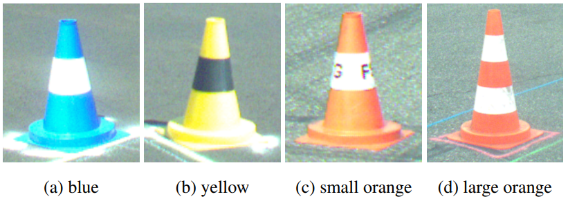
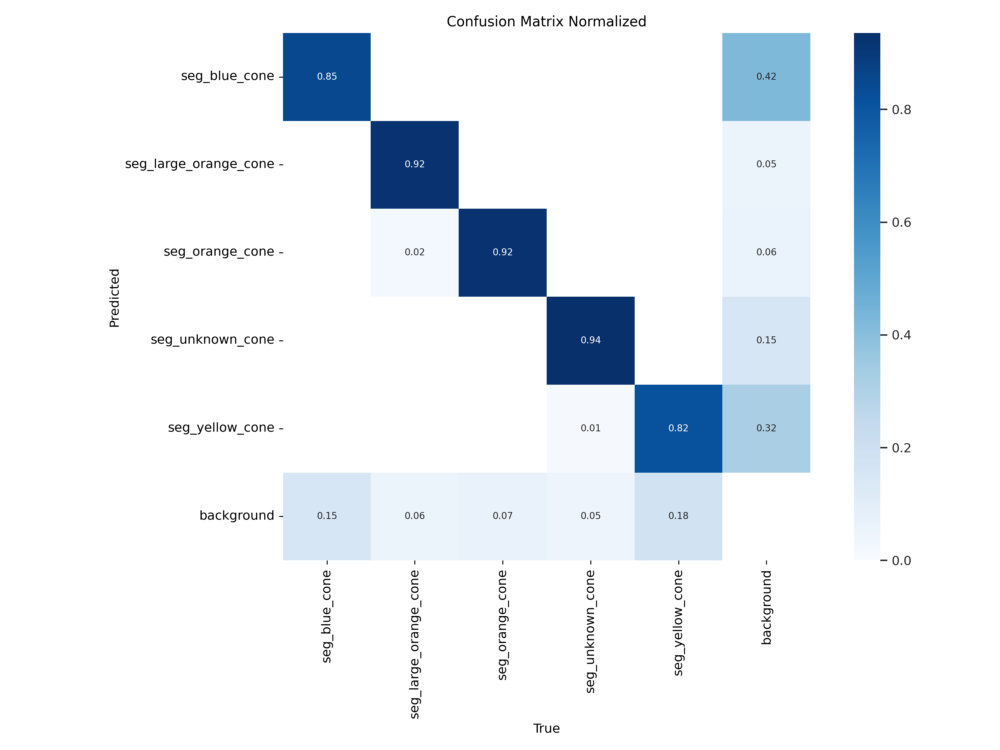
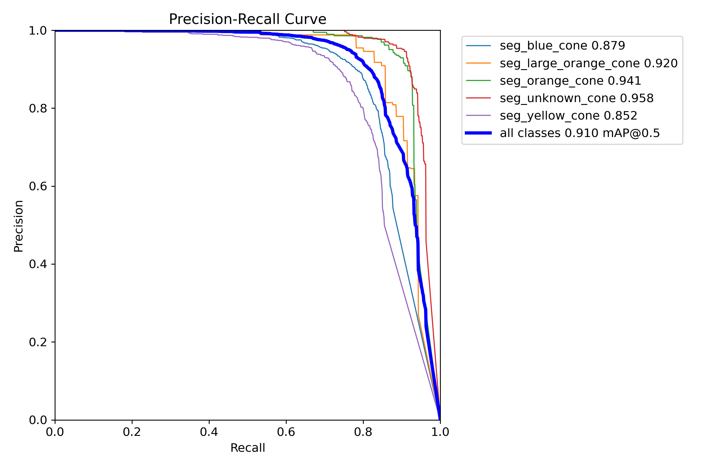
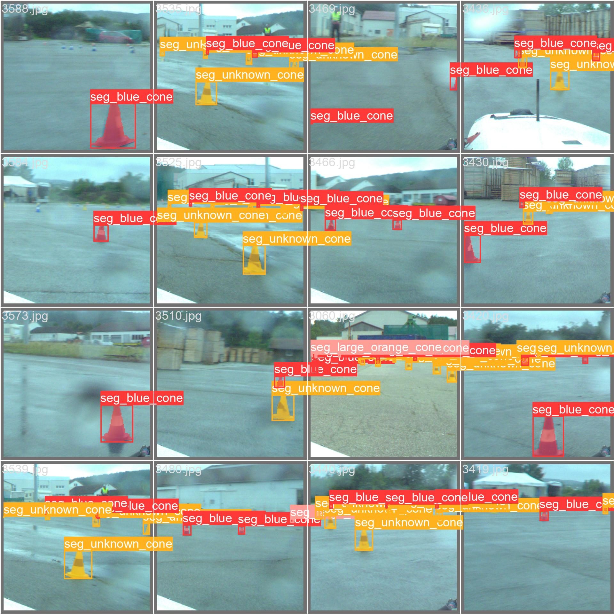
### evaluation
The purpose of this branch is to provide the Python codes which we have implemented in order to process the outcomes of our algorithms and present them in a suitable way. In particular, orbslam2 and orbslam3 return a file camera.csv containing the estimated sequence of coordinates which describe the movement of the agent in the space. Moreover, orbslam3 provides also an additional cones.csv file at the end of the execution. In this latter we store the estimated (x,y,z) coordinates of each cone detected by YOLO. With the scripts made available in this branch we can plot the estimated trajectories of the camera together with the position of the cones which delimit the circuit. 
### Contributors
For any questions, feedback, or issues encountered while using this perception system, please open an issue on this repository. Feel free to contact us.
- Stefano Genetti stefano.genetti@studenti.unitn.it
- Thomas Nonis thomas.nonis@studenti.unitn.it
### References
- Campos, C., Elvira, R., Rodriguez, J. J. G., Montiel, J. M. M., & Tardos, J. D. (2021). "ORB-SLAM3: An Accurate Open-Source Library for Visual, Visual–Inertial, and Multimap SLAM." IEEE Transactions on Robotics, 37(6), 1874–1890. (DOI: 10.1109/TRO.2021.3075644)[http://dx.doi.org/10.1109/TRO.2021.3075644]
- Mur-Artal, R., & Tardos, J. D. (2017). "ORB-SLAM2: An Open-Source SLAM System for Monocular, Stereo, and RGB-D Cameras." IEEE Transactions on Robotics, 33(5), 1255–1262. (DOI: 10.1109/TRO.2017.2705103)[http://dx.doi.org/10.1109/TRO.2017.2705103]
- Mur-Artal, R., Montiel, J. M. M., & Tardos, J. D. (2015). "ORB-SLAM: A Versatile and Accurate Monocular SLAM System." IEEE Transactions on Robotics, 31(5), 1147–1163. (DOI: 10.1109/TRO.2015.2463671)[http://dx.doi.org/10.1109/TRO.2015.2463671]
- Vödisch, N., Dodel, D., & Schötz, M. (2022). "FSOCO: The Formula Student Objects in Context Dataset." SAE International Journal of Connected and Automated Vehicles, 5(12-05-01-0003). (https://arxiv.org/abs/2012.07139)[https://arxiv.org/abs/2012.07139]
